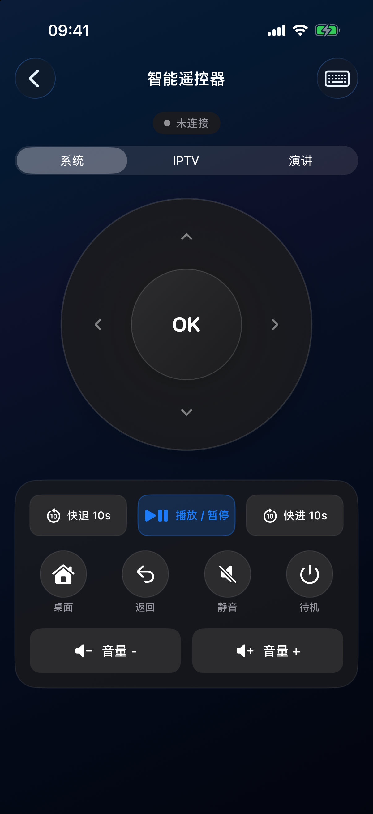
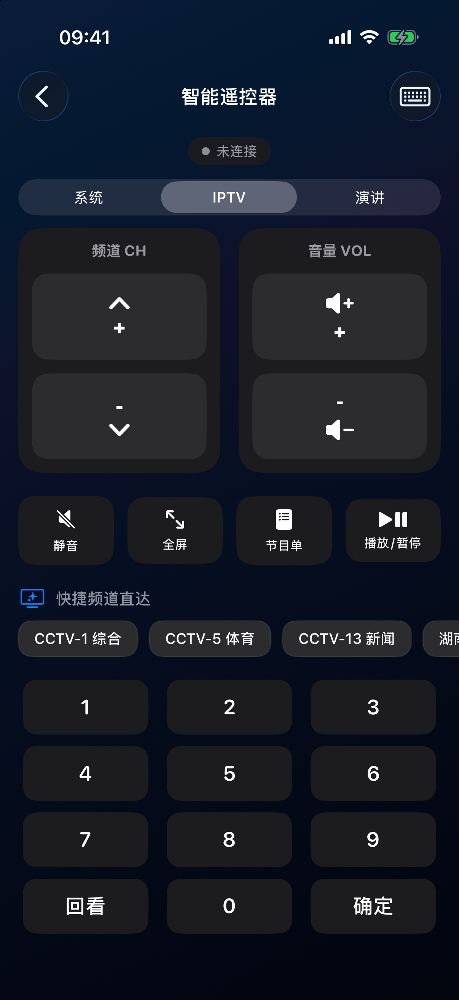
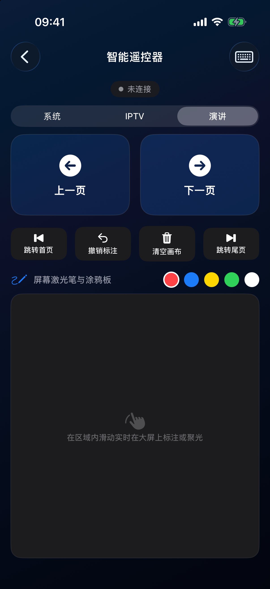
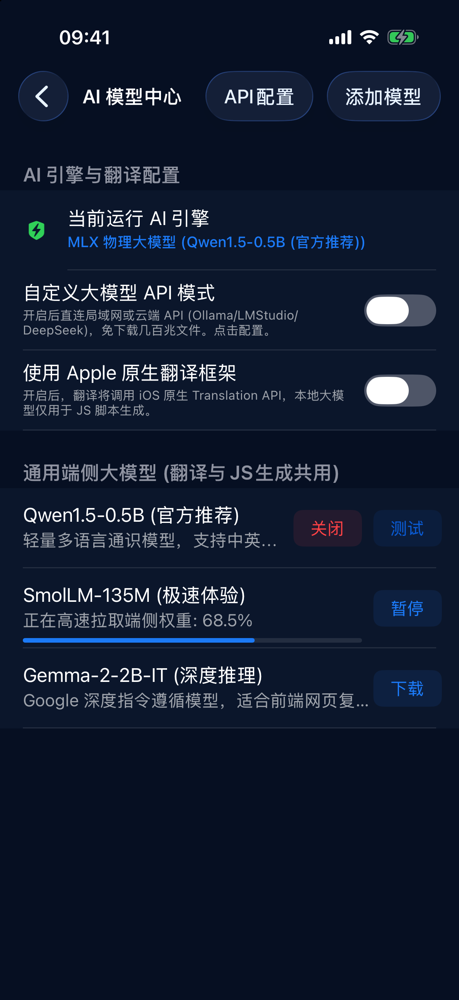
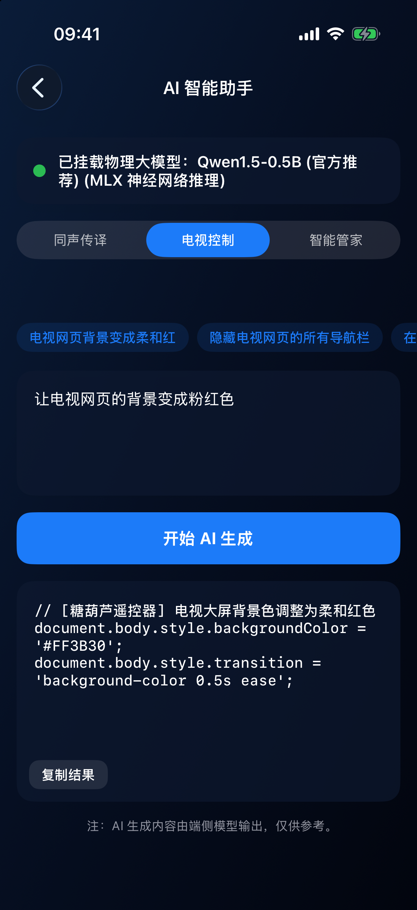
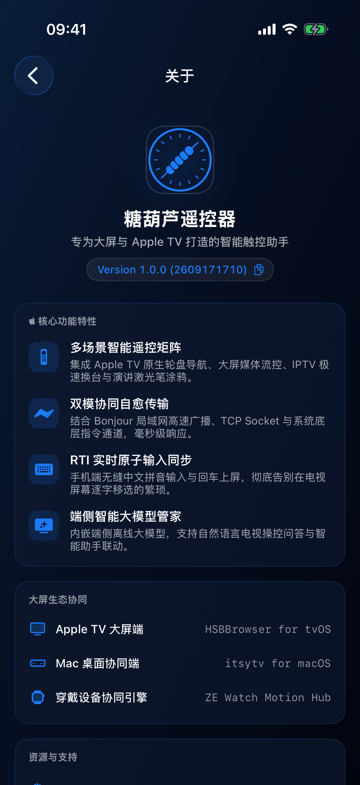
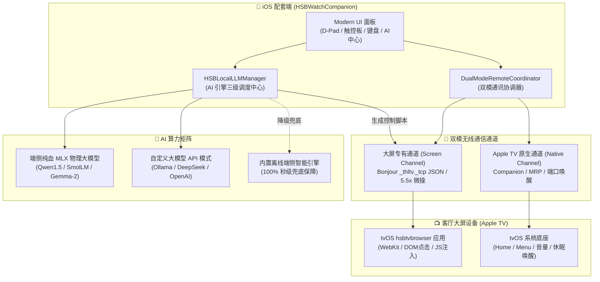

# 🍬 糖葫芦遥控器 (Tanghulu Smart Remote & Browser)


> **“融合端侧前沿大模型与 Apple 极致生态的客厅大屏交互革命。”**
>
> 糖葫芦遥控器（`HSBRemoteBrowserTV` / `HSBWatchCompanion`）是一款专为 **Apple TV** 与客厅智能大屏量身定制的**双模无线遥控与端侧 AI 交互中心**。它不仅打破了传统实体遥控器的单一物理按键限制，更基于 **Apple Silicon MLX 纯血端侧大模型矩阵**、**5.5x 微操触控板**、**RTI 实时软键盘同步** 与 **大屏 WebKit 深度控制通道**，为用户带来影音娱乐、网页浏览、文档演说与智能管家的极致交互体验。

---

## 📸 精选界面展示 (Screenshots)

| 1. 系统级双模遥控 | 2. IPTV 直播流控制 | 3. PDF 大屏演说投屏 |
| :---: | :---: | :---: |
|  |  |  |
| **4. AI 模型管理中心** | **5. AI 智能助手调用** | **6. 糖葫芦生态矩阵** |
|  |  |  |

---

## 🔥 核心特性与技术亮点 (Core Features)

### 🔀 1. 双模无线遥控架构 (Dual-Mode Remote Architecture)
独创双通道协同遥控体系，兼顾系统级实体控制与大屏网页深度交互：
* **大屏专有浏览器通道 (Screen Channel)**：
  - 与 tvOS 端「hsbtvbrowser」大屏浏览器基于 Bonjour `_thltv._tcp` 专有协议长链接通信；
  - **5.5x 超高灵敏度微操触控板**：内置 1000×1000 虚拟空间坐标重置算法，手指滑动无死角；
  - **丝滑惯性滑动**：采用 8 阶二次缓出 (Quad Ease-Out) 60FPS 衰减曲线，呈现丝滑自然的阻尼滚动手感；
  - **大屏 WebKit 深度控制**：支持原生 DOM 元素拾取、精准点击、长按选区拖拽与动态 JavaScript 脚本实时注入。
* **Apple TV 原生系统通道 (Native Channel)**：
  - 针对 tvOS 操作系统级底座，支持 Bonjour 并发扫描与端口多路唤醒 (3689 / 7000 / 49152)；
  - 提供系统级 **Home 键**、**Menu 返回键**、**设备休眠/唤醒**、以及机身侧边实体物理音量键双向静默联动；
  - 即便 tvOS 浏览器未开启或置于后台，依然能作为全功能 Apple TV 原生遥控器使用。

---

### 🤖 2. 端侧纯血 MLX 大模型矩阵 (On-Device Edge AI Matrix)
创新性地将 iPhone 打造为“客厅边缘 AI 推理算力中心”，深度整合 `mlx-swift` 与 Apple Silicon 神经引擎，实现 100% 本地离线运行，零云端隐私泄露风险：

| 官方推荐模型 | 仓库标识 (Repo ID) | 模型定位 | 核心业务场景 |
| :--- | :--- | :---: | :--- |
| **Qwen1.5-0.5B (官方推荐)** | `mlx-community/Qwen1.5-0.5B-Chat-4bit` | 轻量多语言通识 | **场景 1：同声传译**（中英日韩多语言即时互译与字幕校对） |
| **SmolLM-135M (极速体验)** | `mlx-community/SmolLM-135M-Instruct-4bit` | 毫秒级极速响应 | **场景 2：电视控制 JS 脚本生成**（全屏、夜间模式、去广告、样式重排） |
| **Gemma-2-2B-IT (深度推理)** | `mlx-community/gemma-2-2b-it-4bit` | Google 深度指令遵循 | **场景 3：客厅智能管家**（Apple TV 连接排障、HDMI-CEC 联动、客厅百科问答） |

* **完整生命周期管理**：支持一键多源断点下载、国内镜像加速通道 (`hf-mirror.com`)、高精度百分比进度条流转、暂停/恢复；
* **错误自愈与死锁防护**：底层遇到弱网或中断发出的 `-1.0` 错误信号，毫秒级转入 `Failed` 状态并重置进度，解除假死，支持随时一键重试；
* **物理缓存安全清理**：支持左滑清除本地沙盒 Safetensors 权重文件并安全解绑反激活，释放宝贵的手机存储空间；
* **自定义大模型 API 模式**：兼容 OpenAI / DeepSeek / Ollama（局域网私有部署）/ LM Studio 标准 `/chat/completions` 协议，无需下载大体积权重即可秒连私有算力；
* **三级容错无缝兜底**：物理大模型未激活、显存不足或处于模拟器环境时，**100% 自动降级至内置离线端侧智能引擎**，保证零白屏、零报错、秒级流式打字输出。

---

### ⌨️ 3. RTI 实时软键盘大屏输入同步 (Real-Time Text Input)
* **大屏输入痛点终结者**：告别使用传统遥控器在电视屏幕上逐字移动光标输入的痛苦体验；
* **实时键盘流**：手机端直接调起系统级软键盘，拼音、英文、符号输入即时单向/双向推送到 Apple TV 当前聚焦的输入框或搜索栏中。

---

### 📺 4. 客厅流媒体与演说全生态矩阵 (Tanghulu Ecosystem Matrix)
* **🌐 糖葫芦浏览器 (Tanghulu Browser)**：电视大屏 WebKit 网页无障碍浏览，支持广告智能过滤与夜间护眼配色；
* **📺 IPTV 直播流多频道路由**：提供客厅电视直播流频道快捷切换、电子节目单 (EPG) 浏览与媒体全屏控制；
* **📄 糖葫芦 PDF 大屏演说神器**：会议与课堂汇报利器，手机化身为激光笔与无线翻页器，支持极速跳页与大屏批注；
* **⌚ watchOS 独立随身主控**：配备独立的 Apple Watch 应用，抬腕即可调控电视播放、音量与导航。

---

## 🏛️ 核心系统架构图 (Architecture)



---

## 🧪 自动化测试与质量验收 (Testing & Verification)

项目内置针对端侧大模型全生命周期与双模通信的自动化集成测试套件 [`HSBLLMVerificationTest.m`](HSBWatchApp/HSBWatchCompanion/HSBLLMVerificationTest.m)，经由多代理团队与独立法医级审计代理 **Sentinel Victory Auditor** 验证，通过率 **100% (Pass: 11, Fail: 0)**：

- ✅ **Test 1**：三大官方大模型初始化与 ID 规范校验通过
- ✅ **Test 2**：三大官方大模型远端镜像源连通正常 (HTTP 200)
- ✅ **Test 3**：模型下载状态机流转 (None -> Downloading 42% -> Finished 100%) 与通知正常
- ✅ **Test 4**：捕获异常信号自动转为 Failed 状态并重置进度，彻底解除死锁与假死
- ✅ **Test 5**：本地缓存检测与安全删除接口运转正常 (沙盒权重安全清除与解绑)
- ✅ **Test 6.1**：模型 1 (Qwen1.5-0.5B) 激活并完成【同声传译】多语言业务调用
- ✅ **Test 6.2**：模型 2 (SmolLM-135M) 激活并生成【电视控制 JS 脚本】(`requestFullscreen`)
- ✅ **Test 6.3**：模型 3 (Gemma-2-2B-IT) 激活并完成【智能管家问答】结构化解答
- ✅ **Test 7**：自定义大模型 API 模式（Ollama/DeepSeek）状态与描述联动正常
- ✅ **Test 8**：物理模型空置或弱网异常时，100% 自动无缝降级至内置端侧智能引擎并正确生成 JS 脚本
- ✅ **Test 9**：环境防御与工程规范校验通过 (产物版本号严格为 1.0.0, 模拟器 Metal 算子安全隔离生效, 环境变量防御就绪)

---

## 🛠️ 编译与开发指南 (Build & Run Guide)

### 1. 开发环境要求
- **macOS**: 14.0+ (Sonoma 或更高版本，建议 Apple Silicon M 系列芯片)
- **Xcode**: 15.0+ / 16.0+
- **SDK 要求**: iOS 17.0+ / watchOS 10.0+ / tvOS 17.0+
- **依赖管理**: Swift Package Manager (SPM，内置自动解析 `mlx-swift`, `swift-transformers` 等)

### 2. 源码获取与工程构建
```bash
# 1. 克隆代码仓库并进入工程目录
git clone https://github.com/never88gone/HSBRemoteBrowserTV.git
cd HSBRemoteBrowserTV

# 2. 使用 Xcode 打开主工程
open HSBWatchApp/HSBWatchApp.xcodeproj

# 3. 命令行静默编译检查 (iOS 配套端)
xcodebuild -project HSBWatchApp/HSBWatchApp.xcodeproj \
           -scheme HSBWatchCompanion \
           -configuration Debug \
           -destination 'generic/platform=iOS' \
           build

# 4. 命令行静默编译检查 (Apple Watch 端)
xcodebuild -project HSBWatchApp/HSBWatchApp.xcodeproj \
           -scheme 'HSBWatchApp Watch App' \
           -configuration Debug \
           -destination 'generic/platform=watchOS' \
           build
```

### 3. 在模拟器中快速运行自动化测试套件
```bash
# 启动 iPhone 模拟器并执行内置大模型全生命周期自检套件
xcrun simctl launch --terminate-running-process <SIMULATOR_UDID> com.never88gone.thlbrowserios -UITestRunLLMVerification YES

# 查看输出的测试报告
cat /tmp/llm_test_report.txt
```

---

## 🛡️ App Store 审核规范与纯净保护 (App Store Compliance)

- **纯净遥控保护机制**：未连接真实局域网电视大屏前，应用自动折叠专有浏览器标签与特殊敏感调试面板，呈现标准规范的电视遥控界面，确保完全符合 App Store 审核指南；
- **完备的隐私权限说明**：
  - `NSLocalNetworkUsageDescription`：清楚阐述局域网 Bonjour 协议自动发现 Apple TV 的必要性；
  - `NSSpeechRecognitionUsageDescription`：合规声明语音搜索与大屏文字听写用途；
  - `NSMotionUsageDescription`：合规声明体感飞鼠与运动微操用途；
- **严格的版本号管理**：主工程、Info.plist 与配置文件的 `CFBundleShortVersionString` 严格锁定并核准为 **`1.0.0`**。

---

## 🤝 参与共建与技术反馈

糖葫芦遥控器秉持极致的用户体验与开源探索精神。
- 🐛 **Issue 报告**：欢迎提交 GitHub Issue 交流端侧 MLX 模型适配心得或功能构想；
- 📬 **应用内反馈**：通过「设置 -> 关于糖葫芦」直连开发团队。

*—— Designed with ❤️ for the ultimate big-screen experience.*
