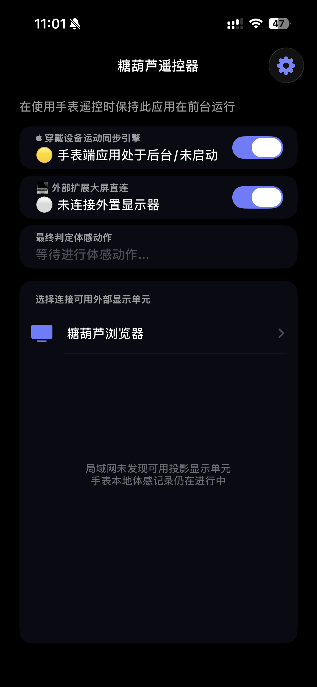
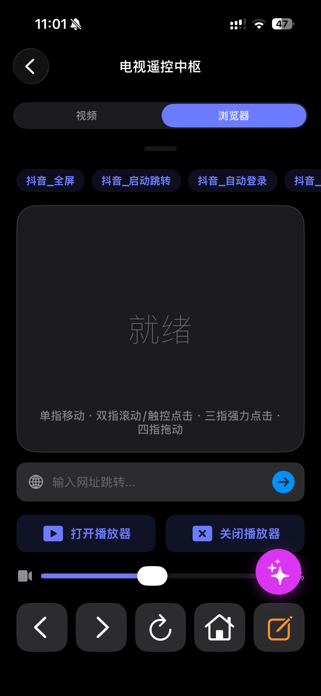
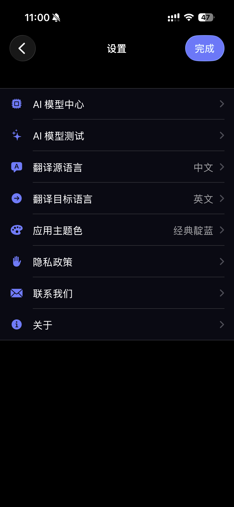

# 🍬 糖葫芦浏览器与智能遥控 (Tanghulu Remote & Browser)


> **“将边缘计算与 Apple 极致生态完美融合的客厅革命。”**
> 
> 糖葫芦不仅是一款专为智能电视和 Apple TV 设计的增强型遥控与大屏浏览器应用，更是一个**基于端侧大模型 (On-Device LLM)** 与 **实时计算机视觉 (Vision)** 构建的多屏互动引擎。它旨在打破物理遥控器的限制，重塑大屏多媒体娱乐、跨设备通讯及无障碍浏览的极致体验。

---

## 📸 应用展示 (Screenshots)

| 设备发现 | 浏览器控制 |
| :---: | :---: |
|  |  |
| **视频控制** | **设置** |
|  |  |

---

## 🔥 核心特性与技术巅峰 (Core Features)

### 🤖 1. 端侧大模型驱动 (On-Device Edge AI)
* **私有大模型算力中心**：创新性地将 iOS App (iPhone/iPad) 化身为“掌上 AI 服务器”。通过深度集成 `MLX-Swift` 与 `CoreML`，在本地直接运行先进的大语言模型 (LLM)，并为局域网内的 Apple TV (tvOS) 提供毫无延迟的专属翻译与智能推理服务，彻底摆脱云端依赖，数据 100% 隐私绝对安全。
* **智能页面重构**：大模型根据大屏浏览场景，实时生成并注入 JavaScript 脚本，自动屏蔽广告、提取核心视频流、重排复杂网页，实现“PC 端网页，电视端顶级体验”。
* **断点续传加载**：自研高可用大模型下载与存储引擎，支持超大参数模型的断点续传与动态分块加载，榨干极致性能。

### 👁️ 2. 毫秒级 OCR 视频实时字幕翻译 (Real-time Vision Translation Pipeline)
* **动态视觉捕获**：利用 Apple Vision 框架，精准锁定大屏视频底部 20% 的字幕区域，在 60FPS 的视频播放中实现无掉帧的文字提取。
* **高性能内存池 (Flyweight Pattern)**：独创的翻译缓存调度机制与 NSCache 享元模式拦截重复请求，配合严格的并发锁与自动释放池 (Autoreleasepool) 彻底消除循环引用，将翻译延迟降至毫秒级。

### ⚡ 3. 超低延迟 P2P 局域网通讯 (Ultra-low Latency Network)
* **空间控制引擎**：通过底层 UDP 广播、多播 DNS (Bonjour) 协议及自动 NAT 穿透，实现 iPhone/Apple Watch 与 Apple TV 之间的极速发现与连接。
* **高帧率光标与手势**：指尖滑动即刻同步电视光标，支持 120Hz 丝滑触控映射，彻底告别传统红外/蓝牙遥控器的迟滞感。

### ⌚ 4. 苹果全家桶生态协同 (Apple Ecosystem Synergy)
* **watchOS 独立主控**：在 Apple Watch 上直接控制电视播放进度、音量与焦点，抬腕即控。
* **三端状态同步**：iOS (Remote)、tvOS (Player/Browser)、watchOS (Companion) 三端无缝流转，书签、历史记录与播放状态跨设备实时同步。

### 🧩 5. 糖葫芦全生态矩阵万能遥控 (Universal Ecosystem Controller)
作为糖葫芦生态的核心枢纽，iOS 遥控器能智能识别当前大屏端运行的应用类型，并动态提供专属的控制与 AI 服务面板：
* **🌐 糖葫芦浏览器 (Tanghulu Browser)**：将手机化身为 120Hz 高精度触控板。实现大屏上的丝滑光标移动、多标签页快速切换与 DOM 元素精准点击；同时直接调用手机端大模型，为大屏网页提供实时翻译与动态去广告脚本。
* **📺 糖葫芦TV (Tanghulu TV)**：提供沉浸式的影音追踪面板。支持极速盲操拖拽进度条、音量调节，以及一键切换多语言音轨与外挂字幕；并能一键唤醒大屏 OCR 实时提取，由手机端 AI 返回超低延迟的字幕翻译。
* **🛜 糖葫芦投屏 (Tanghulu Cast)**：实现流媒体的零延迟精准掌控，双端极速同步投屏播放状态。独创的互动通道，让您在手机端键盘打字即可直接将弹幕、消息或控制指令发送至电视大屏。
* **📄 糖葫芦PDF (Tanghulu PDF)**：大屏演说级翻页神器。将手机化身为专业幻灯片激光笔，支持盲滑翻页、极速跳页，甚至能通过手机直接在大屏文档上对核心文本或图片进行焦点批注，是会议汇报与教学演示的完美搭档。

---

## 🧭 技术路线与架构演进 (Architecture & Roadmap)

本项目采用超大规模工程要求的**模块化 Monorepo 架构**进行开发，确保极高的可维护性与扩展性：

- 🧱 **Framework 级解耦**：彻底剥离基础组件 (`HSBCommon`)、通讯矩阵 (`HSBShare`) 与核心业务 (`HSBBrowser`)，通过严格的头文件管理与依赖注入，实现多 Target 极速编译。
- 🛡️ **内存与并发安全**：抛弃易致死锁的传统 GCD 堆砌，全面拥抱 Swift 现代并发模型 (`async/await`, `Actor` 隔离)，保障极端长链接与重度 AI 推理下的 0 崩溃率。

---

## 🚀 快速体验 (TestFlight Beta)

我们诚邀您感受未来客厅的交互形态，加入我们的公开 Beta 测试：

👉 **[点击这里，立刻加入 TestFlight 抢先体验](https://testflight.apple.com/join/uZz9NZz4)**

*(支持设备：iPhone / iPad / Apple TV / Apple Watch)*

---

## 🛠️ 开发者：编译与部署指南 (Build & Deployment)

本项目涵盖了 iOS、tvOS 和 watchOS 端的全套源码。如果您是开发者并希望参与构建：

### 1. 极致的开发环境要求
- **IDE**: Xcode 15.0 及以上版本 (建议最新)
- **OS**: macOS 14.0+ (Sonoma 及以上)
- **Swift**: 5.9+ (深度使用宏与现代并发)
- **System SDKs**: iOS 15.0+ / watchOS 8.0+ / tvOS 15.0+

### 2. 自动化构建与本地运行
```bash
# 1. 获取最新源码并进入工程目录
git clone https://github.com/your-org/HSBRemoteBrowserTV.git
cd HSBRemoteBrowserTV

# 2. 启动 Xcode 工作空间 (请打开 .xcworkspace)
open HSBWatchApp.xcworkspace

# 3. 依赖解析 (SPM)
# 项目内置数十个 SPM 依赖（如 mlx-swift, yyjson, swift-transformers 等）
# Xcode 将在首次打开时自动解析并编译 Metal 加速内核。

# 4. 选择对应平台的 Target (HSBBrowserApp / HSBWatchCompanion) 并 Cmd+R 运行。
```

---

## 💬 参与共建与技术反馈

糖葫芦遥控器的成长离不开极客与用户的支持。
- **ISSUE 追踪**：如果遇到任何功能异常或有狂野的功能构想，请提交 GitHub Issue。
- **App 内直连**：通过“设置 -> 反馈”实时上传运行日志以协助排查。

*—— Designed with ❤️ for the ultimate big-screen experience.*
